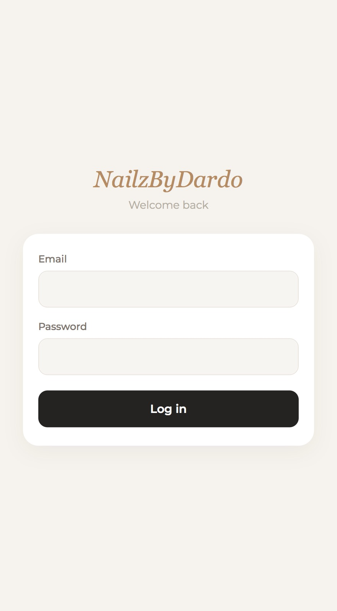
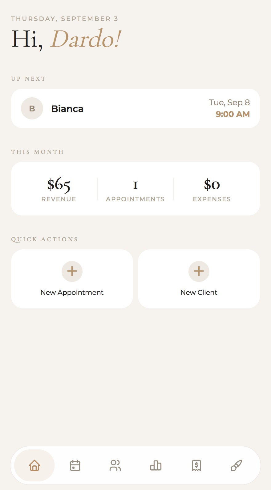
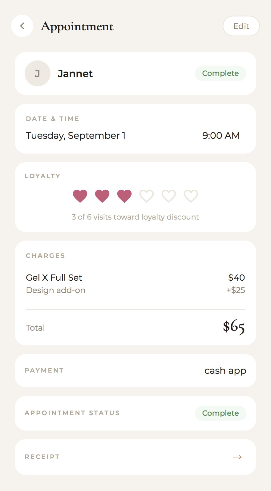
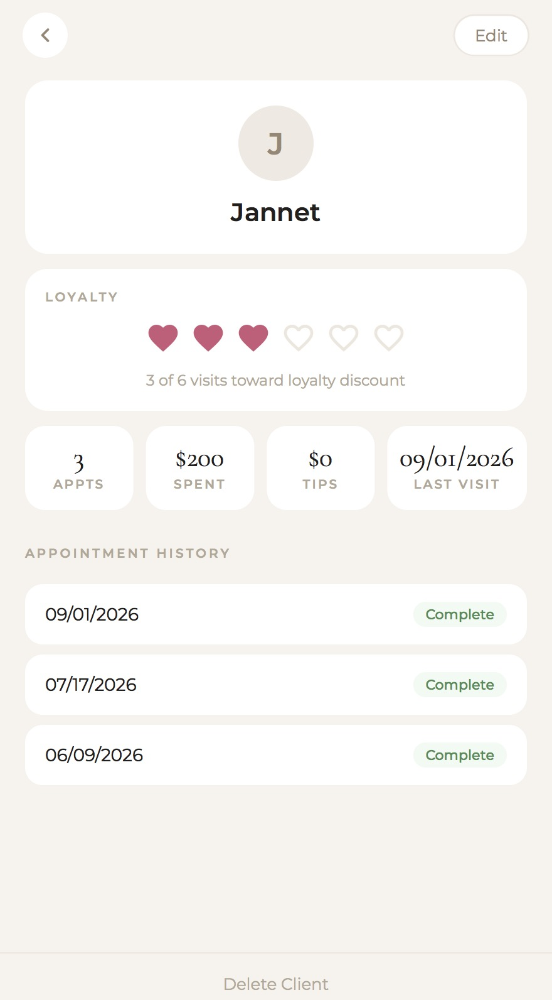
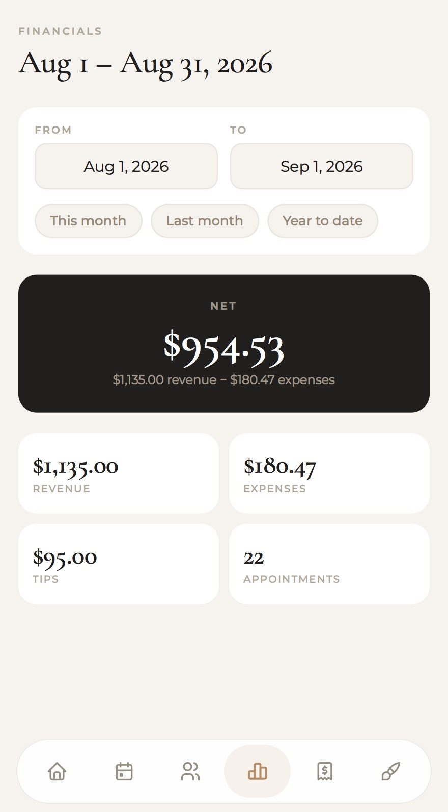

# NailzByDardo

A mobile-first PWA for running a nail salon business — clients, appointments, services, expenses, and financial reporting. Built as the frontend for a small business management app used by a real nail tech.

Talks to the [NailzByDardo API](https://github.com/anagarcia3174/nailzbydardo-backend). The API owns business rules, money math, and persistence; this app is the operator UI on top of that.

## Screenshots

<p>
  
  
  
  
  
  
</p>

Login · Dashboard · Appointment · Receipt · Client · Financials

## Tech Stack

| Layer | Technology |
|---|---|
| Language | TypeScript |
| UI | React 19 |
| Bundler | [Vite](https://vite.dev) |
| Routing | [React Router](https://reactrouter.com) |
| Server state | [TanStack Query](https://tanstack.com/query) |
| Styling | CSS Modules |
| Icons | [Tabler Icons](https://tabler.io/icons) |
| Fonts | Cormorant Garamond, Montserrat |
| PWA | [vite-plugin-pwa](https://vite-pwa-org.netlify.app) |
| Receipts | [html-to-image](https://github.com/bubkoo/html-to-image) |

## Architecture

The UI follows a thin layered structure — pages stay presentational, and HTTP lives in one place:

```
Page (layout, forms, user actions)
↓
Hook (TanStack Query: fetch, cache, mutations)
↓
API module (typed request/response shapes)
↓
api client (fetch + session cookies + error mapping)
↓
NailzByDardo API
```

- **Pages** render screens and collect input. They do not call `fetch` directly.
- **Hooks** wrap each resource in Query keys and mutations. After writes, they invalidate related caches (appointments also refresh dashboard, financials, and client spend).
- **API modules** map 1:1 to backend resources (`/clients`, `/appointments`, `/services`, `/expenses`, `/dashboard`, `/financials`).
- **`api` client** prefixes `VITE_API_URL`, always sends `credentials: "include"` (HTTP-only session cookie), and turns non-OK responses into an `ApiError` using the API’s `{ "error": "..." }` shape.

Auth is a React context: on load it hits `GET /auth/me`; login/logout call `/auth/login` and `/auth/logout`. Unauthenticated routes redirect to `/login`. Authenticated routes wrap in `AppLayout` (bottom nav).

Money from the API is **integer cents**. The UI formats it as USD for display and converts back to cents before sending tips, fees, prices, and expenses.

## Project Structure

```
frontend/
├── index.html
├── vite.config.ts          # React + PWA manifest
├── src/
│   ├── main.tsx            # QueryClient, Router, AuthProvider
│   ├── App.tsx             # route table
│   ├── api/                # HTTP wrappers per resource
│   ├── hooks/              # TanStack Query hooks
│   ├── pages/              # one screen per route
│   ├── components/         # layout, nav, shared editors
│   ├── context/            # session auth
│   ├── types/              # domain types matching the API
│   └── lib/invalidation.ts # cache invalidation after mutations
├── docs/screenshots/       # README images (see Screenshots)
└── public/                 # PWA icons
```

## Features

- **Session-based login** — email/password against the API; no tokens in JS, cookie is HTTP-only
- **Installable PWA** — standalone display, auto-updating service worker, Apple touch icon / status bar meta for phone home-screen use
- **Dashboard** — current-month revenue, tips, appointment count, expenses, and upcoming appointments
- **Clients** — list, create, edit, soft-delete; detail view with visit history, lifetime spend, and a 6-visit loyalty tracker
- **Appointments** — schedule against an existing client; detail view for status (`booked` / `complete` / `no_show` / `cancelled`), services, amount- or percent-based discounts, tip, late fee, payment method (`cash`, `zelle`, `cash_app`, `other`), and loyalty reward
- **Shareable receipts** — appointment receipt screen with line items and totals from `GET /appointments/{id}/total`; export as PNG
- **Services catalog** — create, update, and delete offerings used when adding line items to an appointment
- **Expenses** — log and delete operating costs
- **Financials** — revenue, expenses, appointment count, and tips over a chosen date range (defaults to the current month)

## Screens

All routes except `/login` require a valid session.

| Path | Screen |
|---|---|
| `/login` | Sign in |
| `/dashboard` | Home / month snapshot |
| `/appointments` | Appointment list |
| `/appointments/new` | Book an appointment |
| `/appointments/:id` | Appointment detail |
| `/appointments/:id/receipt` | Receipt (export PNG) |
| `/clients` | Client list |
| `/clients/:id` | Client profile |
| `/services` | Service catalog |
| `/expenses` | Expenses |
| `/financials` | Date-range reporting |

`/` and unknown paths redirect to `/dashboard`. Bottom nav is hidden on client detail, appointment detail, and receipt so those screens can use the full height.

## Running Locally

### Prerequisites

- Node.js 20+
- The [backend](https://github.com/anagarcia3174/nailzbydardo-backend) running (default `http://localhost:8080`) and a provisioned user

### Setup

```bash
cd frontend
npm install
```

Create `frontend/.env`:

```
VITE_API_URL=http://localhost:8080
```

Use the machine’s LAN address instead of `localhost` if you load the app from a phone on the same network (the API URL is baked in at build time, and cookies require a reachable origin).

```bash
npm run dev
```

Vite serves the app with HMR. Production build:

```bash
npm run build
npm run preview
```

## Scripts

| Command | Description |
|---|---|
| `npm run dev` | Dev server |
| `npm run build` | Typecheck (`tsc -b`) then Vite production build |
| `npm run preview` | Serve the production build locally |
| `npm run lint` | ESLint |

## License

MIT
